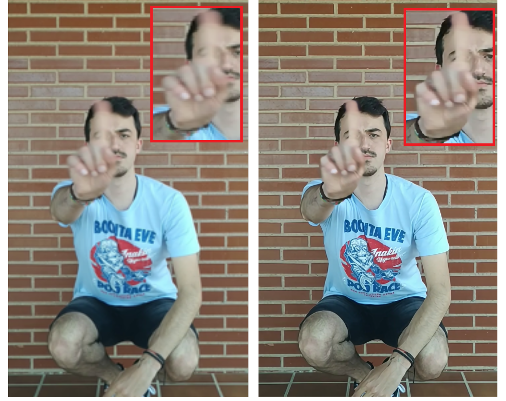

# TFG_EDVR 
## Trabajo de fin de grado de Ingeniería Informática en la Universidad de Burgos. Curso 2020-21

Realizado por:

Gonzalo Murillo Montes

Tutores:

+ Pedro Latorre Carmona
+ César Ignacio García Osorio

En este proyecto se aplica una técnica de super resolución de vídeos ganadora del NTIRE (New Trends in Image Restoration and
Enhancement) challenge 2019, en las categorías dedicadas al vídeo, EDVR (vídeo Restoration with Enhanced Deformable Convolutional
Networks). El objetivo es comprobar los resultados de EDVR e implementar vídeos propios para su procesado. Estos vídeos propios
serían de gestos y acciones humanas. Para complementar a esta herramienta se ha desarrollado una interfaz para poder implementar
vídeos, poder procesarlos y visualizar los resultados.

Basado en el proyecto:
```
@misc{wang2020basicsr,
  author =       {Xintao Wang and Ke Yu and Kelvin C.K. Chan and
                  Chao Dong and Chen Change Loy},
  title =        {BasicSR},
  howpublished = {\url{https://github.com/xinntao/BasicSR}},
  year =         {2020}
}
```

Todo el desarrollo y pruebas se ha realizado en Ubuntu.

Para la instalación de ambos repositorios seguir el apartado PASOS PREVIOS del cuaderno de Jupyter que se proporciona.

Una vez completados habrá que instalar los requerimientos para la interfaz:
  ```bash
  
  
pip install ffmpeg-python
pip install opencv-python
pip install PySimpleGUI
pip install python-vlc
sudo apt install vlc
  ```
  
  Una vez finalizada la instalación para ejecutar EDVR hay dos opciones:
  
  + Referirse al apartado EJECUCIÓN del cuaderno de Jupyter.
  + Usar la interfaz, desplazándose  hasta la carpeta Interfaz y ejecutando  el siguiente  comando:
    ```bash
    python EDVR_UI.py
    ```
    
  Ejemplo de imagen original y procesada por EDVR:
  
  
    
